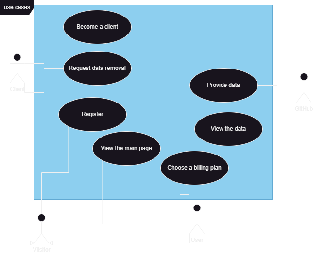

# Business requirements

Our product, StatsNinja, aims to collect statistics about GitHub, process it and present our customers with insightful info.

## Actors

* GitHub
  * The source of the data we collect
* StatsNinja's visitor
  * Any site visitor
* StatsNinja's user
  * Any registered user, with confirmed GitHub account
* StatsNinja's client
  * Any registered user, that purchased any of the billing plans

## Use cases

Use case is a list of actions defining the interactions between an actor and a system to achieve a desired goal.

* GitHub
  * Provides the data
* StatsNinja's visitor
  * View the main page
  * Register
* StatsNinja's user
  * Request their data to be removed
  * Become a client
* StatsNinja's client
  * Choose a different billing plan
  * View the data, provided by the billing plan

The diagram of use cases can be viewed below:

