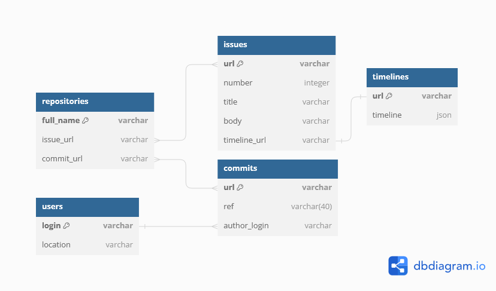
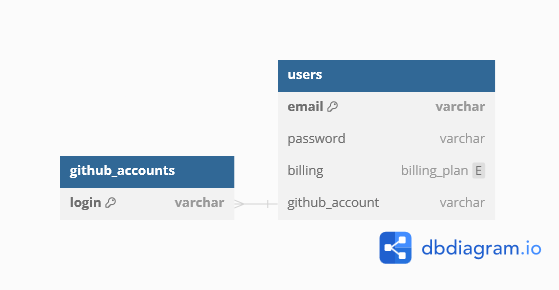

## Physical Model

### Data loader
The db schema for the data loader

It's sql can be accessed via [file](db_artifacts/handler.sql)

### Site
The db schema for the site

It's sql can be accessed via [file](db_artifacts/web.sql)